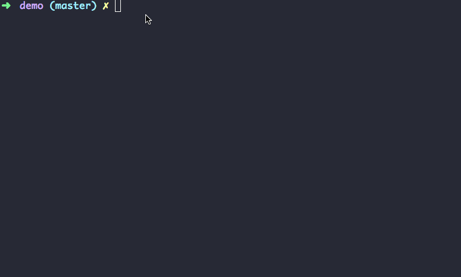

# N.O.M.s

> Universal/isomorphic javascript unit tests for witches.

## Table of contents

- [How to install](#how-to-install)
- [Usage](#usage)
- [Docs and API Reference](https://github.com/afonsopacifer/nomsjs/blob/master/docs/README.md)
- [Versioning](#versioning)
- [Contributing](#contributing)
- [History](#history)
- [License](#license)

## How to install

Verify if you have [node](http://nodejs.org/) and [npm](https://www.npmjs.org/) installed.

### Module

```sh
$ yarn add nomsjs -D
```

<hr>

## Usage

*Create your test file*

```js
// demo.test.js

const { suite, test, assert } = require('nomsjs');

suite('All demo tests', () => {

  test('Should return a correct number', () => {
    return assert(22, 22); // Passed
  });

  test('Should return a correct number', () => {
    return assert(22, 23); // Failed
  });

});
```

*Run your unit tests*

```sh
$ node demo.test.js
```

*Result:*



### All automatic tasks

- `npm test` - Run all tests.
- `npm run test:unit` - Run unit-tests only.
- `npm run test:integration` - Run integration-tests only.
- `npm run lint` - Run ESlint validations for code quality.

## Docs

[See all Docs and API reference here](https://github.com/afonsopacifer/nomsjs/blob/master/docs/README.md)

## Versioning

To keep better organization of releases we follow the [Semantic Versioning 2.0.0](http://semver.org/) guidelines.

## Contributing

Find on our [issues](https://github.com/afonsopacifer/nomsjs/issues/) the next steps of the project ;)
<br>
Want to contribute? [Follow these recommendations](https://github.com/afonsopacifer/nomsjs/blob/master/CONTRIBUTING.md).

## History

See [Releases](https://github.com/afonsopacifer/nomsjs/releases) for detailed changelog.

## License

[MIT License](https://github.com/afonsopacifer/nomsjs/blob/master/LICENSE.md) © [Afonso Pacifer](https://afonsopacifer.github.io/)
